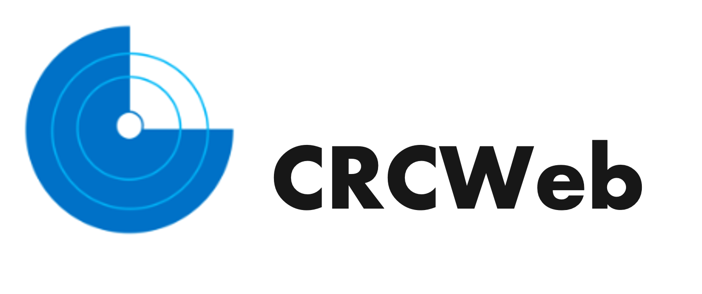

<div align="center">
  
</div>

<p align="center">
    <a href="https://github.com/ArmynC/ArminC-AutoExec/commits/master">
    
    <a href="https://github.com/ArmynC/ArminC-AutoExec/issues">
    
    <a href="https://github.com/ArmynC/ArminC-AutoExec/pulls">
    
    <a href="https://github.com/ImNotDarren/CRCWeb/graphs/contributors">
</p>

> **CRCWeb** is a modern, responsive mobile framework designed to provide online multimedia educational content to users.

---

## 🚀 Table of Contents

- [🚀 Table of Contents](#-table-of-contents)
- [📖 About](#-about)
- [✨ Features](#-features)
- [🛠 Tech Stack](#-tech-stack)
- [🚀 Getting Started](#-getting-started)
  - [Prerequisites](#prerequisites)
  - [Installation](#installation)
  - [Configuration](#configuration)
- [💻 Usage](#-usage)
- [🤖 Build Android](#-build-android)
    - [Create Android bundle (AAB)](#create-android-bundle-aab)
- [🧑‍💻 Build Web](#-build-web)
- [🤝 Contributing](#-contributing)
- [📄 License](#-license)
- [📬 Contact](#-contact)

---

## 📖 About

CRCWeb provides a **React Native** front-end for multimedia educational content distribution.

## ✨ Features

- **Multimedia Educational Content Rendering**: Each module contains Lectures, Content, Activities, Resources, and Quizzes.
- **Realtime Content Update**: Update any content using an Admin account anytime.
- **Fitbit Data Tracking**: Fitbit API Integrated to track each user's wearable data from Fitbit band.

## 🛠 Tech Stack

- **Frontend**: React Native
- **Backend**: Node.js, Express
- **Database**: SQLite

> [!NOTE]
> Backend will be open-source in the future. We're actively working on it.

## 🚀 Getting Started

Follow these steps to get CRCWeb up and running locally.

### Prerequisites

- Node version: `v18.18.2`

- NPM version: `10.2.0`

### Installation

1. **Clone the repository**

   ```bash
   git clone https://github.com/ImNotDarren/CRCWeb.git
   cd CRCWeb
   ```

2. **Install dependencies**

   ```bash
   npm install
   # or
   yarn install
   ```

### Configuration

Copy the example environment file and update the variables:

```bash
cp .env.example .env
# Edit .env with your preferred editor
```

Set the following variables:

- `SERVER_URL` - URL for your backend server
- `FITBIT_OAUTH_REDIRECT_URL`, `FITBIT_CLIENT_ID`, `FITBIT_CODE_VERIFIER` - Fitbit API keys
- `GITHUB_BUCKET` - For PDF rendering

---

## 💻 Usage

**Run the app**

```bash
npx expo run:ios --device
# or
npx expo run:android --device
```

## 🤖 Build Android

```bash
cd android
```

```bash
./gradlew assembleRelease
```

> [!IMPORTANT]
> APK file: `android/app/build/outputs/apk/release/app-release.apk`

#### Create Android bundle (AAB)

```bash
npx react-native build-android --mode=release
```

AAB file in `android/app/build/outputs/bundle/release/app-release.aab`

## 🧑‍💻 Build Web

[[Web Reference]](https://docs.expo.dev/distribution/publishing-websites/#creating-a-build)

Make sure netlify-cli is installed:

```bash
npm install -g netlify-cli
```

Then export web to `/dist` folder:

```bash
npx expo export -p web
```

You can serve locally to test it by running:

```bash
npx serve dist --single
```

Then, push to netlify and follow the commands in your terminal:

```bash
netlify deploy --dir dist
```

```bash
netlify deploy --prod
```

---

## 🤝 Contributing

We welcome contributions! Please follow these steps:

1. Fork the repository.
2. Create a new branch: `git checkout -b feature/YourFeatureName`.
3. Make your changes and commit: `git commit -m "Add some feature"`.
4. Push to the branch: `git push origin feature/YourFeatureName`.
5. Open a Pull Request describing your changes.

<!-- Please read our [CONTRIBUTING.md](CONTRIBUTING.md) for detailed guidelines. -->

---

## 📄 License

This project is licensed under the MIT License. See the [LICENSE](LICENSE) file for details.

---

## 📬 Contact

- **Maintainer**: Darren Liu ([@ImNotDarren](https://github.com/ImNotDarren))
- **Email**: darren.liu@emory.edu
- **Project Link**: [https://github.com/ImNotDarren/CRCWeb](https://github.com/ImNotDarren/CRCWeb)